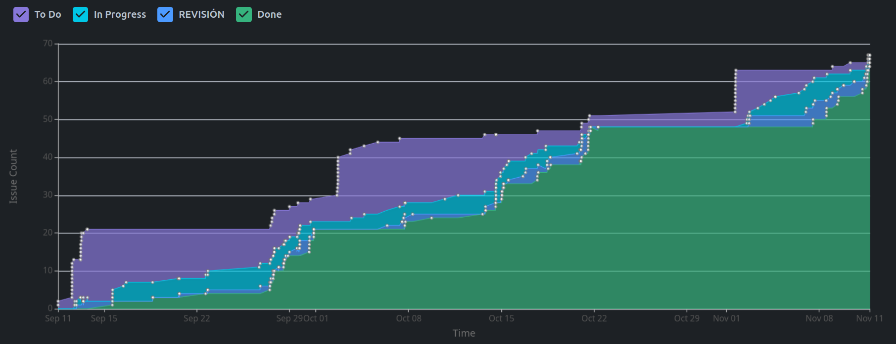
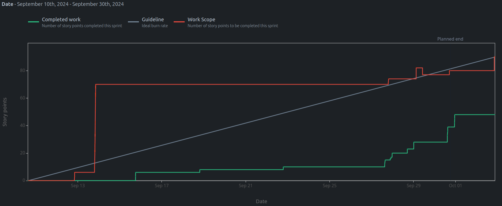
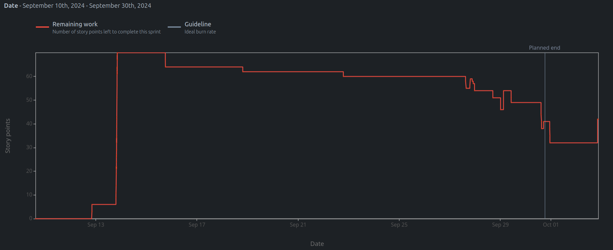
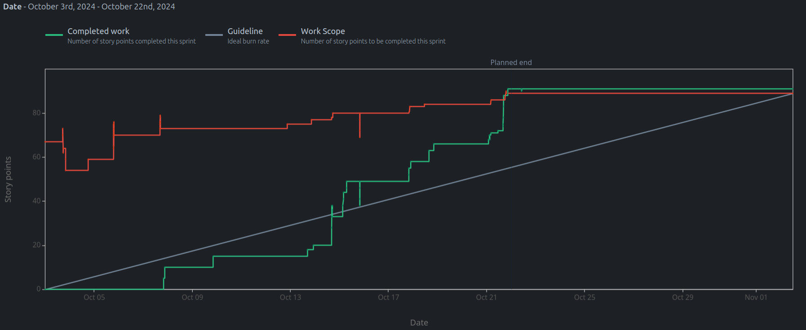
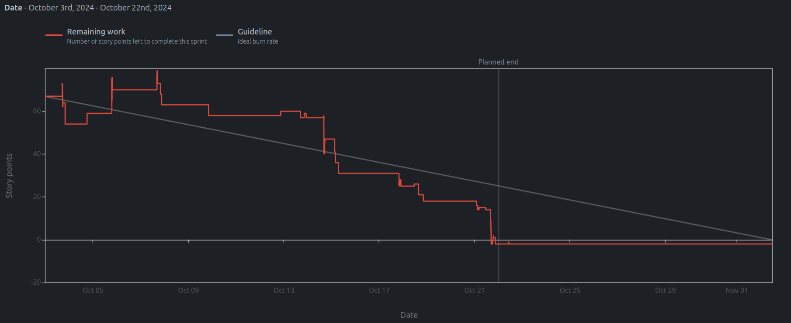
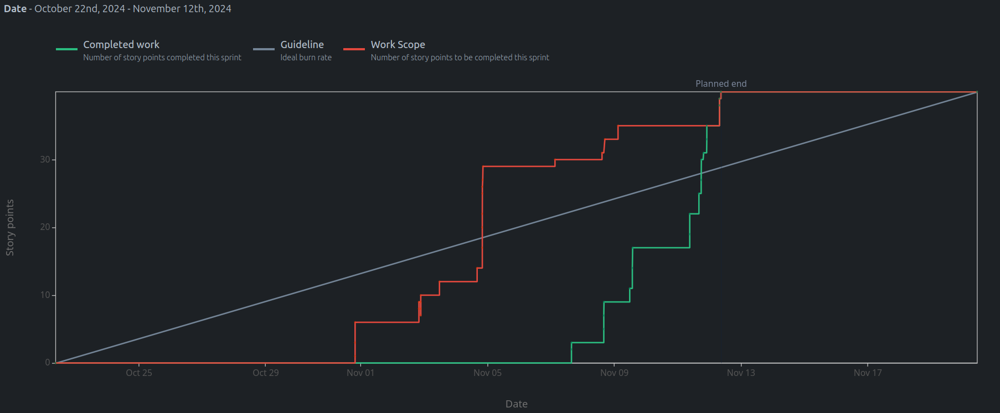
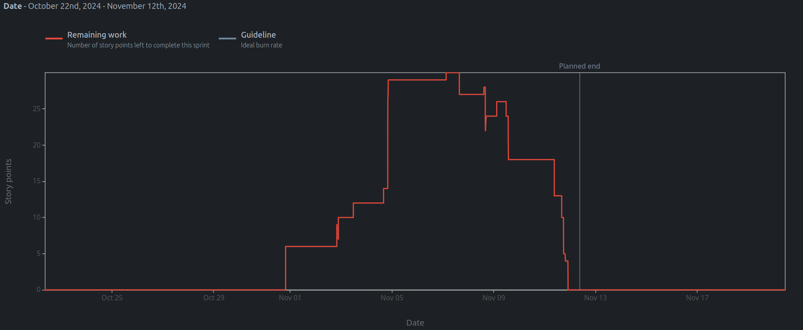

# El Switcher: Desarrollo de una plataforma web para el juego de mesa

## Resumen Ejecutivo

El proyecto tiene como objetivo desarrollar una plataforma web interactiva que permita a los usuarios disfrutar en línea del juego de mesa  "El Switcher", replicando la experiencia del juego físico e incorporando sus reglas y los requisitos especificados por el cliente/profesor.

## Motivación

Este proyecto fue desarrollado en el marco de la materia Ingeniería de Software de la carrera Ciencias de la Computación en la Universidad Nacional de Córdoba (FAMAF). Durante el segundo cuatrimestre de 2024, participé con un equipo multidisciplinario simulando un entorno profesional, aplicando el conocimiento adquirido en análisis, arquitectura,  diseño, codificación, testing y entrega e instalación de proyectos de software, aprendidos en la materia.

El objetivo académico fue fortalecer habilidades fundamentales en ingeniería de software, trabajo colaborativo y liderazgo técnico. Utilizando metodologías ágiles y herramietnas modernas de desarrollo contribuyendo a la creación de un producto funcional y bien documentado.

## Organización y Metodología

### Características principales:
- **Metodología:** Scrum con roles rotativos de Scrum Master y Product Owner.
- **Duración:** 3 Sprints / (2 meses)
- **Entregas:**  Al final de cada sprint, se realiza una reunión de entrega que incluye la presentación de un video demostrativo, un análisis de la cobertura de pruebas, y una discusión con los clientes/profesores responsables de la especificación de los requerimientos del proyecto.
- **Equipo:** 
  - 2 desarrolladores front-end. 
  - 3 desarrolladores back-end. 
  - 1 desarrollador full stack. 
- **Tecnologías utilizadas:** 
  - **Backend:** FastAPI, Python, WebSockets, SQLite. 
  - **Frontend:** Node.js, JavaScript/TypeScript. 
  - **Testing:** Pytest y Vitest.
  - **Gestión de tareas:** Jira.

## Mi contribución

En este proyecto, realizé el rol de scrum master y de programador backend. Algunas de mis responsabilidades claves incluyeron:

#### **Liderazgo como Scrum Master (Sprint 2)**:
- Facilitación de reuniones ágiles (Dailys, Poker Planning). 
- Resolución de bloqueos y mejora del flujo de trabajo. 
- Creación y priorización de tickets en Jira, asegurando criterios de aceptación claros y objetivos alineados con el sprint. 
- Supervisión del progreso utilizando métricas. 

#### Implementación técnica
- **Desarrollo de multiples tickes backend:**
  - **Tickets propios:**
    - Organizar la arquitectura del repositorio backend.
    - Implementación de la funcionalidad para abandonar partidas no iniciadas.
    - Desarrollo de la lógica para iniciar una partida.
    - Sanitización y normalización del código para mejorar su mantenimiento y legibilidad.
    - Implementación de la búsqueda y validación de figuras resaltadas en el tablero.
    - Incorporación de la funcionalidad para manejar el color prohibido en el juego.
  - **Trabajo en Pair Programming:**
    - Desarrollo de la funcionalidad para crear un jugador.
    - Implementación de la lógica para crear una partida.
    - Desarrollo de la funcionalidad para jugar una carta de figura.
  - **Bugfixes:**
    - Ajuste para cambiar el color prohibido al bloquear una figura.
    - Corrección de errores en las cartas de figura.
    - Resolución de conflictos en merges.
    - Corrección de los valores esperados en el endpoint para la creación de usuarios.

- **Testing:**
  - Implementé pruebas unitarias y de integración basadas en clases de equivalencia para garantizar la funcionalidad y calidad de cada módulo desarrollado.

- **Arquitectura**

  - Diseñé la arquitectura del backend utilizando el enfoque de **arquitectura hexagonal** con **vertical slicing** facilitando la separación de capas y la escalabilidad del sistema.
  - Documentación detallada del diseño en el repositorio:
[**Enlace al proyecto**](link_al_proyecto)

## Conclusión
Este proyecto no solo me permitió desarrollar un producto funcional adquiriendo habilidades técnicas, sino que también fortaleció mis habilidades blandas en áreas clave como el liderazgo ágil, el desarrollo técnico individual y la colaboración en equipo.

# Analisis Detallado del proceso

## Métricas de Progreso
### Cumulative Flow Diagram

Podemos observar que el tiempo de vida de cada ticket es corto. Una vez que un ticket ingresa a la etapa To Do, pasa rápidamente a la etapa de Revisión, donde otro miembro del equipo, seleccionado previamente, analiza el código implementado y sugiere posibles mejoras. 

Este flujo ágil es posible gracias a dos factores principales:
1. Claridad en los tickets: La redacción precisa y detallada realizada por el Scrum Master permite que cada integrante comprenda con exactitud las expectativas y objetivos. 
2. Definición previa de la API: Antes de cada sprint, se establecen estándares claros para la API, lo que reduce ambigüedades y facilita el desarrollo fluido. 

A continuación, se presenta un ejemplo detallado de un ticket, que incluye información clave y su estructura: [SW-23-iniciar-partida](SW-23-iniciar-partida.md)

---

### Resumen del progreso de los Sprints  
#### Sprint 1
##### Burnup Report

##### Remaining Work

#### Sprint 2
##### Burnup Report

##### Remaining Work

#### Sprint 3
##### Burnup Report

##### Remaining Work

### Resolución de Desafíos

En el **Sprint 1**, enfrentamos problemas al usar mockeo completo de la API para pruebas, lo que resultó ineficiente y aumentó la deuda técnica. 

En el **Sprint 2**, realizamos un ajuste en nuestra estrategia, cambiando a un mockeo directo de la base de datos.  Este enfoque permitió la implementación de pruebas más precisas y orientadas a las necesidades reales del sistema. Esto permitió alcanzar los objetivos del sprint y completar la deuda técnica acumulada. 

Cabe aclarar que el equipo experimento dificultades para mantener un ritmo ideal de trabajo debido a los exámenes correspondientes al cuatrimestre. Esto está reflejado en los incrementos abruptos en la cantidad de tickets completados en cortos periodos de tiempo. 

## Proceso de Codificación

Se utilizó un proceso de **codificación incremental**, avanzando iterativamente en diseño e implementación. En casos puntuales, especialmente si los requerimientos no estaban completamente claros o para diseñar la bases de datos, aplicamos la metodología de **pair programming**, lo que facilito la resolución y mejoro la calidad del codigo. 

## Pruebas y Cobertura

Se realizaron test de caja negra, seleccionando el test suite mediante la técnica de participado por **clases de equivalencia** asegurando la calidad y robustez del sistema desarrollado. 

A continuación, se presentan los resultados más destacados de las pruebas y el análisis de cobertura:

### **Frontend**
- **Archivos de prueba ejecutados**: 30 
- **Total de pruebas**: 254 
- **Cobertura de código**:
  - **Declaraciones**: 83.77% 
  - **Ramas**: 87.87% 
  - **Funciones**: 96.42% 
  - **Líneas**: 83.77%

### **Backend**
- **Total de pruebas ejecutadas**: 142 
- **Cobertura total alcanzada**:
  - **Archivos analizados**: 3992 líneas de código.
  - **Líneas no cubiertas**: 212.
  - **Cobertura global**: **95%**